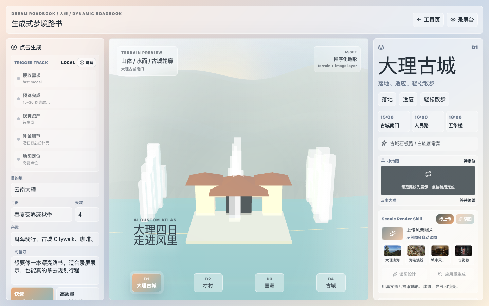

# LilyTravelAgent

An AI travel-roadbook prototype for generating cinematic, recording-ready trip guides. LilyTravelAgent uses MiniMax for itinerary and visual-design generation, Amap for map coordinates, and a Three.js dream-roadbook interface for a more expressive pre-trip preview.



## What It Does

- Generates a customized Chinese travel roadbook from a short trip brief.
- Shows a `/dream` roadbook with minimal text, 2.5D terrain, day switching, a compact map, and asset controls.
- Upgrades the `/dream` WebGL layer with filmic tone mapping, soft shadows, animated water, atmospheric haze, and real-terrain renderer parity.
- Uses destination-specific cinematic scene presets, starting with Dali's Cangshan / Erhai / old-town layer and a coastal island / bay layer with rendered lighthouse, bay, harbor, and sunset-deck cues.
- Includes local `/dream` demo roadbook switches for Dali and coastal routes, so recording and QA can show multiple presets without calling MiniMax.
- Uses a two-stage Agent flow: fast preview first, then fuller travel details in the background.
- Turns uploaded or sample landscape photos into MiniMax-M3 render blueprints for cinematic destination previews.
- Caches generated preview assets locally, keeps history versions, and lets you mark a final cover.
- Includes `/studio`, recording docs, local Dali/coastal demo switches, and a one-click sample-photo library for Vibe Coding content creation.

## Demo Routes

- `/` - practical roadbook generator
- `/dream` - cinematic dream-roadbook prototype
- `/studio` - 16:9 recording mode
- `/share-preview` - final cover and roadbook share-card view

## Setup

1. Install dependencies:

```bash
npm install
```

2. Create local environment config:

```bash
cp .env.local.example .env.local
```

3. Fill these values in `.env.local`:

```bash
MINIMAX_API_KEY=your_minimax_key
MINIMAX_BASE_URL=https://api.minimaxi.com/v1
MINIMAX_FAST_MODEL=MiniMax-M2.7-highspeed
MINIMAX_QUALITY_MODEL=MiniMax-M3
MINIMAX_THINKING=disabled
MINIMAX_PREVIEW_MAX_COMPLETION_TOKENS=1800
MINIMAX_PREVIEW_TIMEOUT_MS=60000
MINIMAX_MAX_COMPLETION_TOKENS=5000
MINIMAX_TIMEOUT_MS=180000
MINIMAX_SCENIC_MODEL=MiniMax-M3
MINIMAX_SCENIC_BASE_URL=https://api.minimaxi.com/v1
MINIMAX_SCENIC_PATH=text/chatcompletion_v2
MINIMAX_SCENIC_TIMEOUT_MS=120000
MINIMAX_SCENIC_MAX_COMPLETION_TOKENS=2200
MINIMAX_SCENIC_MAX_IMAGE_BYTES=6291456
MINIMAX_IMAGE_MODEL=image-01
MINIMAX_IMAGE_TIMEOUT_MS=120000
PREVIEW_ASSET_CACHE=on
AMAP_KEY=your_amap_web_service_key
```

4. Start the app:

```bash
npm run dev
```

Open `http://localhost:3000`.

Use `http://localhost:3000/studio` for the 16:9 recording mode.

`/studio` has local Dali/coastal demo switches for recording the same product story without waiting for live generation: the input panel, roadbook preview, and top status all update together while the real "现场生成" path remains available.

Use `http://localhost:3000/dream` for the generative dream-roadbook prototype with minimal text, Three.js terrain, and an optional MiniMax cinematic preview image layer. The default renderer uses ACES filmic tone mapping, soft shadows, animated water, atmospheric haze, and a composited AI-image backdrop so the fallback view still feels cinematic when image generation is unavailable.

For the default Dali roadbook, `/dream` also mounts a destination-specific cinematic scene preset from `lib/cinematic-scene-preset.ts`: layered Cangshan silhouettes, Erhai shoreline curves, Bai courtyard blocks, day-specific landmark silhouettes, day-directed atmosphere and motion, a focus marker, a world-space D1-D4 route rail, and a small day-director camera pose so D1-D4 change both the label and the framing. The same renderer now also supports a coastal island / bay preset with sea bands, sandbars, lighthouse arrival, turquoise bay sail, harbor arcade, and sunset-deck geometry. A compact Scene Inspector in the right rail exposes the active preset, shot cue, D1-D4 director timeline, route progress, and lens/parallax values for recording the Agent visual pipeline.

Use the local demo roadbook switch in the `/dream` control panel to move between the Dali and coastal sample routes without calling MiniMax. This is intended for recording and visual QA; the normal "生成梦境路书" button still runs the two-stage Agent generation flow. `/dream` also shows a Studio Bridge card with a recording-suite coverage badge that returns to the matching `/studio?demo=...` recording workbench.

Use `http://localhost:3000/share-preview` for the 16:9 post-cover recording card. `/dream` generates the query link automatically from the current roadbook and asset cache.

`/dream` uses two-stage generation: first a lightweight dream preview, then a background full-detail roadbook pass. After the preview roadbook is available, it also requests `/api/generate-preview-asset` to generate a 16:9 cinematic destination image; if image generation fails, the procedural Three.js scene remains as the fallback. The image prompt also receives the active cinematic scene direction when a destination preset is available, so the AI backplate can align with the same day focus, landmark, and atmosphere as the WebGL scene.

The `/dream` Scenic Render Skill panel lets you upload a local PNG/JPG/WebP landscape photo. `/api/generate-scenic-render-design` asks MiniMax-M3 to turn that photo into a structured render blueprint: terrain, architecture, water/vegetation, lighting, camera, materials, Three.js plan, and an image-generation prompt. When you regenerate the preview asset, that blueprint is added to the cinematic image prompt so the destination preview is more grounded in the uploaded scene.

For recording, `/dream` also includes a one-click real-photo sample library with Dali, coast, city skyline, and China alley examples. Clicking a sample loads it and automatically starts the MiniMax-M3 photo-to-render design step. The local files live in `public/sample-photos/`, with source attribution in `public/sample-photos/ATTRIBUTION.md`.

Preview images are cached locally under `.lily-cache/preview-assets` by default. The cache key includes destination, day count, visual style, model, prompt, and roadbook content, so repeating the same roadbook/style reads the saved image instead of calling image generation again.

The `/dream` right-side asset panel shows the current cache key, cache time, source, clear action, and force-regenerate action for recording the visual asset pipeline. Every successful real image generation is also saved into a local history drawer, so users can compare, restore, and mark a final roadbook cover without calling the image model again.

After a cover is locked, the share-preview card presents the final cover, roadbook title, four-day route, cache key, and asset status as a clean recording-ready handoff view.

## AI Landmark Preset (v0.7.0)

v0.7.0 adds AI-generated landmark presets via M3. Click "生成 AI 地标" in `/dream` to use M3-generated geometry, or rely on the 8 procedural fallbacks. The schema lives in `lib/landmark-preset.ts`; results are cached under `.lily-cache/landmark-presets/`.

### Error handling (v0.8.0)

v0.8.0 wraps every M3 call in `lib/m3-client.ts` with a centralized retry policy (3 attempts, exponential backoff with jitter) and `lib/m3-error-classifier.ts` to categorize failures into 8 types — `network` / `timeout` / `rate_limit` / `server` are retryable; `auth` / `parse` / `schema` / `invalid_request` are not. `components/error-ux.tsx` surfaces a Chinese error message, a "重试" button, and a fallback notice whenever a request degrades to procedural assets, so the failure path is visible during recording as well as in real use.

## Real Terrain Pipeline (Optional)

To enable real terrain in /dream: set MAPBOX_TOKEN in .env.local. The "真实地形管线" toggle in the /dream right panel will then fetch Mapbox terrain-rgb + OSM Overpass buildings. Without a token, the toggle falls back to the procedural Three.js scene. Both renderer paths share the same high-quality WebGL baseline: color-managed output, ACES tone mapping, high-performance antialiasing, and soft shadow maps.

v0.5.0 adds full 高德 3D building pipeline: extensions=all, multi-type-code queries, heuristic height estimation. Set `AMAP_KEY` in `.env.local`. The pipeline runs alongside the Mapbox/Overpass sources; missing tokens gracefully fall back to procedural buildings.

## Verification

```bash
npm run lint
npm test
npm run build
npm run check:dream-visuals
DREAM_DEMO=coast npm run check:dream-visuals
DREAM_LENS=low-skyline npm run check:dream-visuals
npm run check:dream-lenses
npm run check:studio-visuals
npm run check:studio-dream-handoff
npm run index:recording-assets
npm run check:recording-suite
```

`npm run check:dream-visuals` expects the local dev server to be running at `http://localhost:3000/dream` unless `DREAM_URL` is set. It writes D1-D4 screenshots, `summary.json`, `index.html`, and `clip-notes.md` under `recordings/visual-checks/`, which is ignored by git and intended for recording/product review. The QA checks WebGL pixels, micro-motion, cinematic matte mounting, Scene Inspector text, Composition profile, Proof Stack readiness, the active Director Lens, and the D1-D4 director timeline. Set `DREAM_DEMO=coast` to make the script click the local coastal sample before running the same checks. Set `DREAM_LENS=low-skyline` or another Director Lens id to record a specific camera direction in the gallery and clip notes.

`npm run check:dream-lenses` runs the same `/dream` visual QA once per Director Lens and writes one local QA pack per lens under `recordings/visual-checks/`. Set `DREAM_LENSES=wide-water,low-skyline` to run a smaller subset.

`npm run check:studio-visuals` expects `http://localhost:3000/studio` unless `STUDIO_URL` is set. It captures the Dali and coastal 16:9 recording layouts and writes `summary.json`, `index.html`, and `clip-notes.md` under `recordings/studio-checks/`.

`npm run check:studio-dream-handoff` expects `http://localhost:3000` unless `HANDOFF_BASE_URL` is set. It verifies both Dali and coastal round trips between `/studio?demo=...` and `/dream?demo=...`, then writes screenshots, `summary.json`, and `clip-notes.md` under `recordings/handoff-checks/`.

`npm run index:recording-assets` scans local `recordings/visual-checks`, `recordings/studio-checks`, and `recordings/handoff-checks`, then writes `recordings/index.html` and `recordings/clip-index.md` as a local asset index.

`npm run check:recording-suite` expects the local dev server to be running at `http://localhost:3000`. It runs the Dali `/dream` visual QA, coastal `/dream` visual QA, Dali Director Lens QA for the four non-auto lens modes, `/studio` visual QA, Studio-Dream handoff QA, and recording asset index in sequence. Set `RECORDING_SUITE_BASE_URL`, `DREAM_URL`, `STUDIO_URL`, or `HANDOFF_BASE_URL` to target another local server.

`/studio` reads `/api/recording-assets` and shows a recording asset readiness badge, the current local recording asset count, Dream/Studio/Bridge counts, product/walkthrough/bridge-validation edit tags, a latest QA pack summary card, recent QA packs with visually distinct Dream/Studio/Bridge badges and usage hints, a copyable recording-suite command, a compact copy/run/refresh/index/bridge-evidence workflow rail, a refresh control, and an "打开总索引" link. The link opens `/api/recording-assets/index`, a local HTML overview with the same pack type, usage labels, and Dream/Studio/Bridge counts. If the local index is missing, `/studio` shows the exact command: `npm run check:recording-suite`.

`/studio` also has a `脚本模式` toggle that adds a compact four-step creator talking track, a Bridge QA evidence status card, a current-shot cue with Bridge QA evidence, four series chapter chips, a Demo Bridge card, a visible recording-suite coverage badge, and a topbar "讲解轨道已打开" cue for 16:9 walkthrough recording. Its "梦境路书" link carries the selected local demo into `/dream` with `?demo=dali` or `?demo=coast`, and `/dream` returns to `/studio` with the same query, so the recording workbench and cinematic preview can hand off in both directions.

## Recording And Learning Assets

- `docs/recording/shot-list.md` breaks the build into screen-recording chapters.
- `docs/recording/video-outline.md` provides short-video and long-video structures.
- `docs/recording/dev-log.md` is the running production log for each clip.
- `docs/recording/recording-asset-pipeline.md` explains the local QA-to-recording-assets workflow.
- `docs/recording/goal-31-40-recap.md` summarizes the Studio presenter-mode and recording-asset workflow run.
- `docs/recording/goal-41-50-recap.md` summarizes the Studio-Dream bridge and recording-suite coverage run.
- `docs/recording/goal-51-60-recap.md` summarizes the Bridge QA evidence asset workflow run.
- `docs/recording/goal-61-70-recap.md` summarizes the `/dream` Cinematic Visual Contract and proof-stack run.
- `docs/recording/goal-71-100-recap.md` summarizes the Director Lens visual pipeline, QA evidence, and recording content run.
- `docs/recording/goal-101-110-recap.md` summarizes the all-lens visual capture and recording asset index run.
- `docs/recording/goal-111-120-recap.md` summarizes the first low-skyline 3D lens-tuning run.
- `docs/recording/studio-dream-demo-script.md` gives a shot-by-shot Studio ↔ Dream demo recording path.
- `docs/recording/bridge-qa-evidence-script.md` gives a short Bridge QA proof clip script.
- `docs/recording/cinematic-visual-contract-script.md` gives a short `/dream` visual-contract recording script for template strategy, Scene Inspector, Proof Stack, and asset state.
- `docs/recording/director-lens-demo-script.md` gives a short `/dream` script for explaining the camera direction selector, Proof Stack, and asset-cache handoff.
- `docs/recording/director-lens-shot-matrix.md` maps every Director Lens mode to a recording move and QA command.
- `docs/recording/lens-visual-capture-workflow.md` explains how to generate and compare one QA pack per Director Lens mode.
- `docs/recording/content-system.md` defines the account content pillars.
- `docs/recording/vibe-coding-learning-journal.md` captures the learning narrative for voiceover.

## Boundaries

- No auth, database, payment, deployment, PDF export, or public sharing in v1.
- Do not hardcode API keys. Keep secrets in `.env.local`.
- AI travel content is planning assistance only. Users must verify opening hours, bookings, prices, weather, traffic, and safety before travel.
